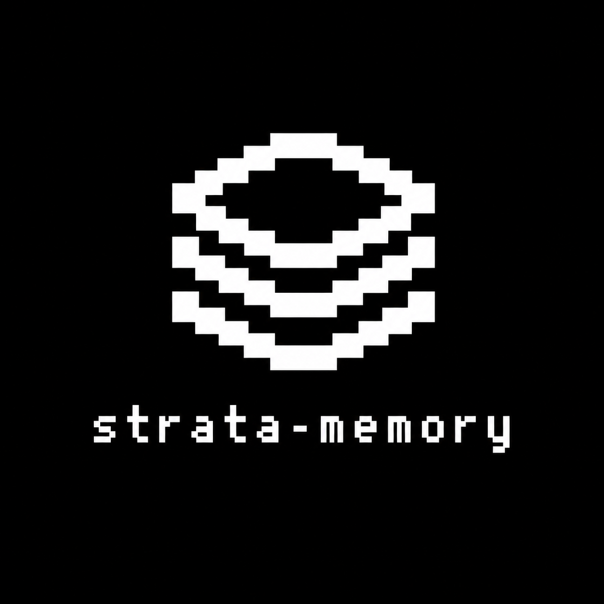

<p align="center">
  
</p>

<h1 align="center">strata-memory</h1>

<p align="center">
  Local-first agentic memory: drafts become knowledge, knowledge becomes executable intelligence.
</p>

<p align="center">
  <a href="License.md"></a>
  <a href="docs/project_spec.md"></a>
  
  
</p>

<p align="center">
  <a href="docs/project_spec.md">Spec</a>
  ·
  <a href="docs/decisions.md">Decisions</a>
  ·
  <a href="docs/implementation_plan.md">Implementation Plan</a>
  ·
  <a href="docs/AGENTS_template.md">AGENTS Template</a>
</p>

---

## What It Is

Strata-Memory is a local-first memory system for agentic work. Markdown files stay canonical. SQLite is a rebuildable index for search, metadata queries, link review, and future retrieval features.

This repository is the **public engine repo**. It will contain the installer, scripts, templates, tests, examples, and documentation for installing Strata into a private vault.

Your private vault lives separately at:

```text
~/.strata-memory
```

## Core Model

Strata uses a core-plus-three-tier lifecycle:

```text
0_core/          # installed engine kernel, not a tier
1_draft/         # raw, unreviewed material
2_knowledge/     # curated durable knowledge
3_intelligence/  # skills, agents, workflows, reports
```

The public repo should not contain those vault-runtime folders at its root. Engine source will live under `src/`, and install tooling will sync managed files into `~/.strata-memory/0_core/`.

## Status

Planning phase. Implementation has not started yet.

Current docs:

| Document | Purpose |
|---|---|
| [Project Spec](docs/project_spec.md) | Product and architecture contract |
| [Decision Log](docs/decisions.md) | Agreed design decisions from planning |
| [Implementation Plan](docs/implementation_plan.md) | Phased build and testing plan |
| [AGENTS Template](docs/AGENTS_template.md) | Starter prompt for the private vault |

## Planned Shape

```text
strata-memory/
├── src/
│   ├── script/
│   ├── template/
│   ├── db/
│   └── doc/
├── example/
├── test/
├── docs/
├── install.sh
├── logo.png
├── License.md
└── README.md
```

## License

MIT. See [License.md](License.md).
